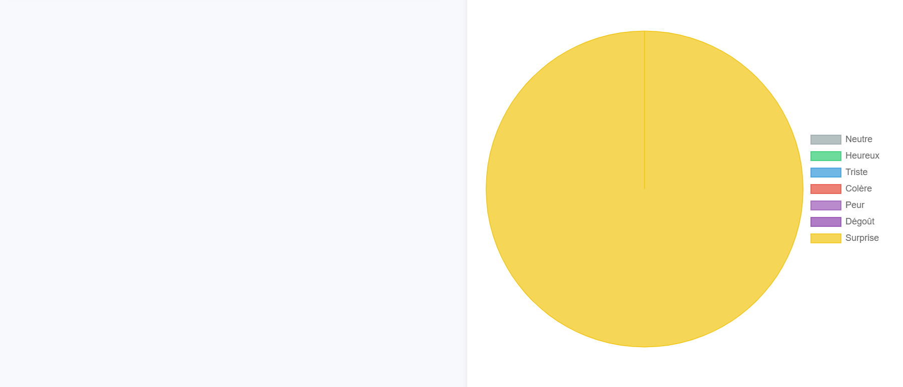

# Speech Emotion Detection

This project leverages audio signal processing and machine learning techniques to detect emotions expressed in the voice in real time. A model trained on a dataset of vocal expressions is executed within a web environment using TensorFlow.js.

## Features

-   **Real-time Audio/Video Capture:** Captures audio and video input directly from the user's microphone and camera.
-   **Vocal Emotion Detection:** Identifies the following emotions from voice input:
    -   Neutral
    -   Happy
    -   Sad
    -   Anger
    -   Fear
    -   Disgust
    -   Surprise
-   **Real-time Visualization:** Dynamically displays the detected emotions.
-   **Report Generation:** Creates detailed reports including dominant emotion analysis, emotional variations over time, and aggregated statistics.

## Installation

### Prerequisites

1.  **Node.js:** Required for managing dependencies and potentially serving the application.  Download from [nodejs.org](https://nodejs.org/).
2.  **npm (Node Package Manager):**  Typically installed with Node.js. Used for managing project dependencies.
3.  **A Web Browser:**  A modern web browser is needed to run the application.

### Installation Steps

1.  **Clone the Repository:**
    ```bash
    git clone https://github.com/YoussefChlih/Speech_emotion_detection.git
    ```

2.  **Navigate to the Project Directory:**
    ```bash
    cd Speech_emotion_detection
    ```

3.  **Install Dependencies:**

    If a `package.json` file exists (check the project directory), use npm:

    ```bash
    npm install
    ```

    (This will install all necessary JavaScript libraries like TensorFlow.js)

4.  **Run the Application:**

    The simplest way to run the application is to open `index.html` directly in your browser.

    For more robust development and testing, a local web server is recommended.  A popular option is `http-server`:

    ```bash
    # Install http-server globally if you don't have it
    npm install -g http-server

    # Run http-server from the project directory
    http-server
    ```

    Then, open your browser and go to the address provided by `http-server` (usually `http://localhost:8080`).

## Usage

1.  **Start Recording:** Click the "Start" button to initiate real-time audio and video capture.  You may be prompted by your browser to grant microphone and camera permissions.

2.  **Stop Recording:** Click the "Stop" button to halt the audio/video capture.

3.  **Generate Report:**  After stopping the recording, click "Generate Report" to display a detailed analysis of the detected emotions, including visualizations and statistics.

## Project Structure

*   `index.html`: The main HTML file that structures the user interface.
*   `styles.css`:  Contains CSS rules to style the application's appearance.
*   `app.js`:  The primary JavaScript file responsible for handling audio/video recording, emotion analysis, and user interaction.
*   `feature-extractor.js`:  JavaScript module dedicated to extracting relevant audio features from the recorded audio data for use by the emotion detection model.
*   `model-converter.py`: A Python script used to convert a pre-trained Keras/TensorFlow model into the TensorFlow.js format, making it compatible for use in the browser.  (Note: This file is typically used during model development/deployment, not day-to-day usage).
*   `model.json`:  The TensorFlow.js model file, containing the trained weights and architecture for speech emotion detection.
*   `data/`: (Optional) - A directory to store example audio files, data used for training, or generated reports. Create if needed.
## Model Training and Updates
*   The `model.json` file contains the model weights and architecture, If you want to update the model with new training data follow these steps:
    1. Update the `model-converter.py` to point the the new `.h5` or `keras` file.
    2. Run the `model-converter.py` to create the new `model.json` file.
    3. Replace the old `model.json` with the new one.
### Example with Images:


**After recording for 16 seconds without the camera's permission**




## Contributing

We welcome contributions! If you have ideas for improvements, bug fixes, or new features, please feel free to open an issue or submit a pull request.  Please follow these guidelines:

*   **Fork the repository.**
*   **Create a branch for your changes.**
*   **Write clear and concise commit messages.**
*   **Test your changes thoroughly.**
*   **Submit a pull request with a detailed description of your changes.**

## License

This project is licensed under the MIT License. See the `LICENSE` file for more details.
